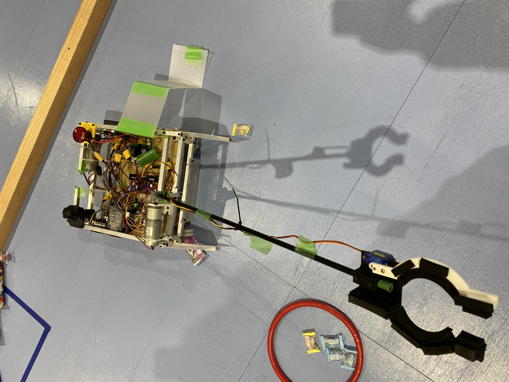
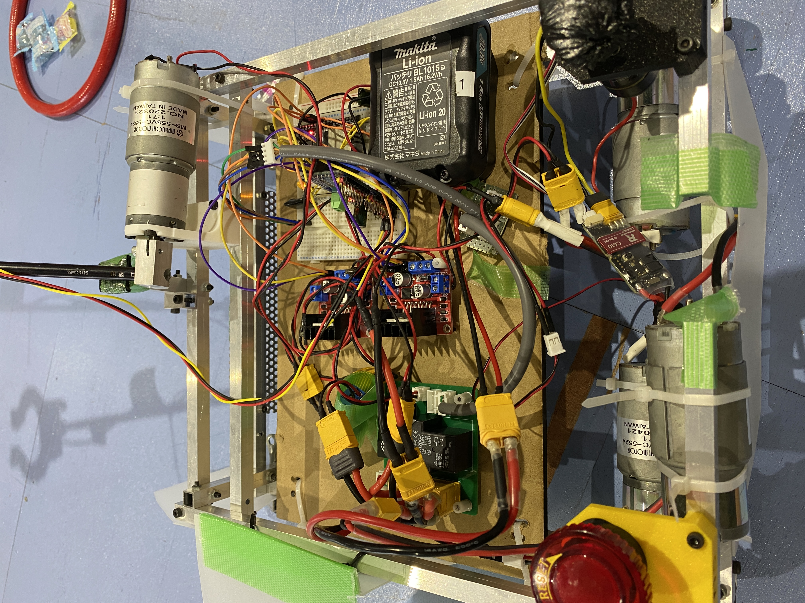
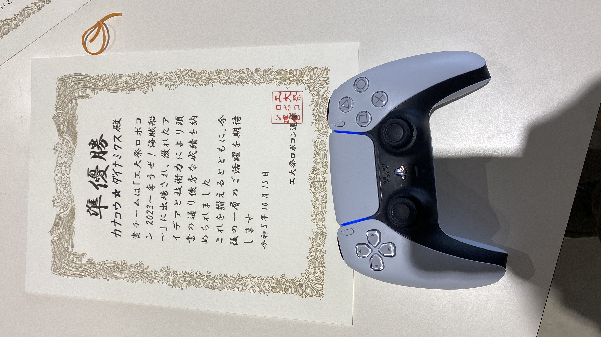

# ハードウェア

  

## 出来ること
アームでつかんで運ぶ．それだけ．  
アームの回転を機体の前後に行うことが出来るため，地面や目標のオブジェクトの高さに合わせて機構限界を設けることが可能．

## 使用したもの
- RS-555 マブチモータ *3 +1  
足回りの減速比は1:27,アームは1:71を使用している． もう一つは足回りが空転しないためのただの錘．
- m2006 , c610ESC *1  
顔面の3Dプリンタオブジェクトを回すただの遊びかと思いきやアーム・足回りの正逆の状態表示をする．
- ESP32 評価ボード
- PCA9685 PWM変換基板
- SG90 サーボモータ
- L298N モータドライバ *2
- [電源基板](https://github.com/KazumaFujino/kicad-2023/tree/main/power)
- マキタのバッテリ 10.8V
- dualsense

# 特徴と機能
- 差動二輪
- 無線操縦
- 遠隔緊急停止
- CAN通信
- PWM(i2c拡張) 16チャンネル

## 大会結果
### 準優勝

### 収穫

